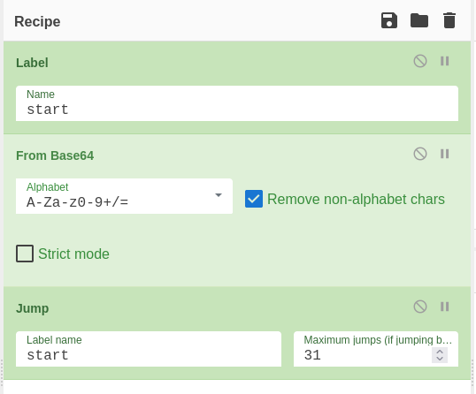
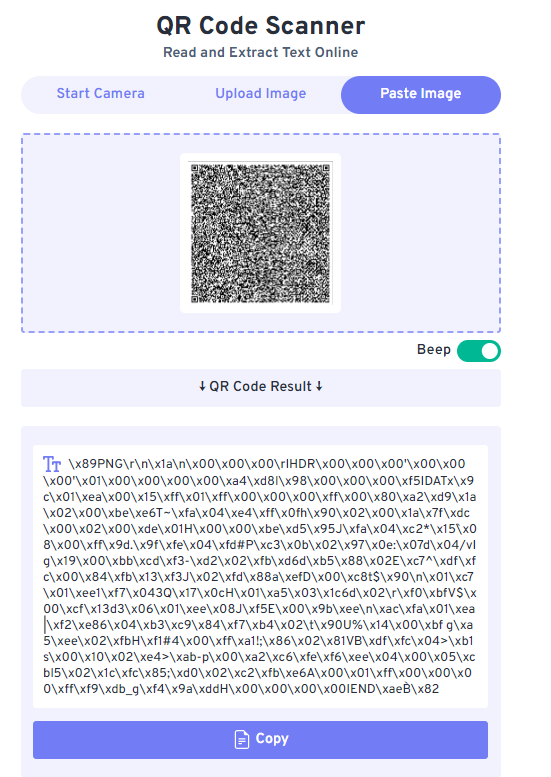
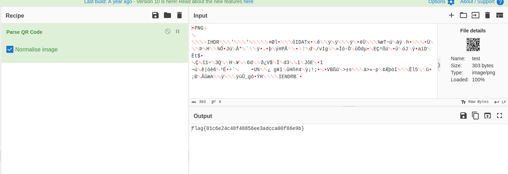

# intro
Hello folks! This post is dedicated to solving Huntress CTF challenges. It might be a bit long, depending on the number of challenges I solve, but I hope you enjoy it and pick up some new tricks along the way. Without further ado, let’s get started!

----
# Base64by32

> category : Scripting

 - we are given a zip code and upon  extracting it we get a regular txt file with some Gibberish text

 ```bash
 ╭─kali at kali in /tmp
╰─○ cat base64by32 | more                                        
Vm0wd2QyUXlVWGxWV0d4V1YwZDRWMVl3WkRSV01WbDNXa1JTVjAxV2JETlhhMUpUVmpBeFYySkVU
bGhoTVVwVVZtcEJlRll5U2tWVQpiR2hvVFZWd1ZWWnRjRUpsUmxsNVUydFdWUXBpUjJodlZGWldk
MVpXV25SalJVcHNVbXhzTlZVeWRGZFdVWEJwVWpKb2RsWkdXbGRrCk1WcFhWMjVTYWxKVmNITlZi
    ...                         ...                     ...
 ```

Based on the challenge name and the fact that the text ends with "==", it's clear this is a Base64 decoding challenge. However, decoding it once still results in gibberish. I suspected that we might need to decode it recursively, and that turned out to be the solution.

To achieve this in CyberChef, you can use a "Jump" and a "Label" to create a recursive decoding loop. Encapsulate the Base64 decoding operation between the Jump and Label, so that after each iteration, the flow returns to the start label. By adjusting the "Max Jump" parameter, you’ll notice the output length decreases until you finally get the flag at iteration 31.

 

 flag is : flag{8b3980f3d33f2ad2f531f5365d0e3970}

# Too Many Bits

 >  category: warmup

we are given these as input 

```
01100110 01101100 01100001 01100111 01111011 01100100 00110000 00110001 00110100 00110111 00110001 00110111 00110000 00110010 01100001 00110001 00110000 00110001 00110011 00110100 01100011 01100100 01100001 01100100 00110001 01100100 01100100 01100100 01100101 00110000 00110110 00110110 00110111 00111000 01100110 00110010 01100110 01111101
```

as you can tell this is some binary code message m so using cyber chef again with the model 'from binary' you can get the flag `flag{d01471702a10134cdad1ddde06678f2f}`

# MatryoshkaQR

> category : warmups

so we are given an RQ code but damn it's soo huge , my phone can't capture all it's details , so looking online i found this webiste 


so let's copy the text an do to our terminal, same the text to a file called image.png 
- if you notice the text is basically in hex so we need to decode it , luckily echo can understand that and can convert \x to ascii for us

```bash
╭─kali at kali in /tmp
╰─○ cat image 
\x89PNG\r\n\x1a\n\x00\x00\x00\rIHDR\x00\x00\x00'\x00\x00\x00'\x01\x00\x00\x00\x00\xa4\xd8l\x98\x00\x00\x00\xf5IDATx\x9c\x01\xea\x00\x15\xff\x01\xff\x00\x00\x00\xff\x00\x80\xa2\xd9\x1a\x02\x00\xbe\xe6T~\xfa\x04\xe4\xff\x0fh\x90\x02\x00\x1a\x7f\xdc\x00\x02\x00\xde\x01H\x00\x00\xbe\xd5\x95J\xfa\x04\xc2*\x15`\x08\x00\xff\x9d.\x9f\xfe\x04\xfd#P\xc3\x0b\x02\x97\x0e:\x07d\x04/vIg\x19\x00\xbb\xcd\xf3-\xd2\x02\xfb\xd6d\xb5\x88\x02E\xc7^\xdf\xfc\x00\x84\xfb\x13\xf3J\x02\xfd\x88a\xefD\x00\xc8t$\x90\n\x01\xc7\x01\xee1\xf7\x043Q\x17\x0cH\x01\xa5\x03\x1c6d\x02\r\xf0\xbfV$\x00\xcf\x13d3\x06\x01\xee\x08J\xf5E\x00\x9b\xee\n\xac\xfa\x01\xea|\xf2\xe86\x04\xb3\xc9\x84\xf7\xb4\x02\t\x90U%\x14\x00\xbf g\xa5\xee\x02\xfbH\xf1#4\x00\xff\xa1!;\x86\x02\x81VB\xdf\xfc\x04>\xb1s\x00\x10\x02\xe4>\xab-p\x00\xa2\xc6\xfe\xf6\xee\x04\x00\x05\xcbl5\x02\x1c\xfc\x85;\xd0\x02\xc2\xfb\xe6A\x00\x01\xff\x00\x00\x00\xff\xf9\xdb_g\xf4\x9a\xddH\x00\x00\x00\x00IEND\xaeB`\x82
╭─kali at kali in /tmp
╰─○ echo `cat image` | tee test
�PNG
▒
IHDR''��l��IDATx��������▒��T~���h�▒��H�ՕJ��*��.���#P�
                                                     �:d/vIg���-���d��E�^�����J��a�D�t$�
��1�3Q
��V$�d3J�E��
���|��6�Ʉ��     �U%� g���H�#4��!;��VB��>�s�>�-p������l5��;����A����_g���HIEND�B`�

```
so all we did is pass the text cated to echo and then save the echoed output to a new file called test with the command `tee`

now if we check the file type of test

```bash
╭─kali at kali in /tmp
╰─○ file test 
test: PNG image data, 39 x 39, 1-bit grayscale, non-interlaced
```
you can see we got an image , no if we open the image , we are going to find another QR code in it , which explains the nomination of the challenge `Matryoshka` which is a russian doll with more dolls in it.
anyways this time just scan the new RQ code with your phone and you'll get the flag 




i solved fee more but am too lazy to write em , yeah that's it thanks everyone for reading this far! hope you learned new things.